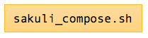
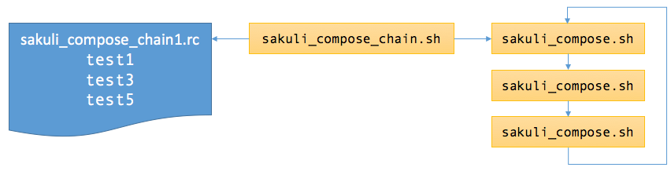
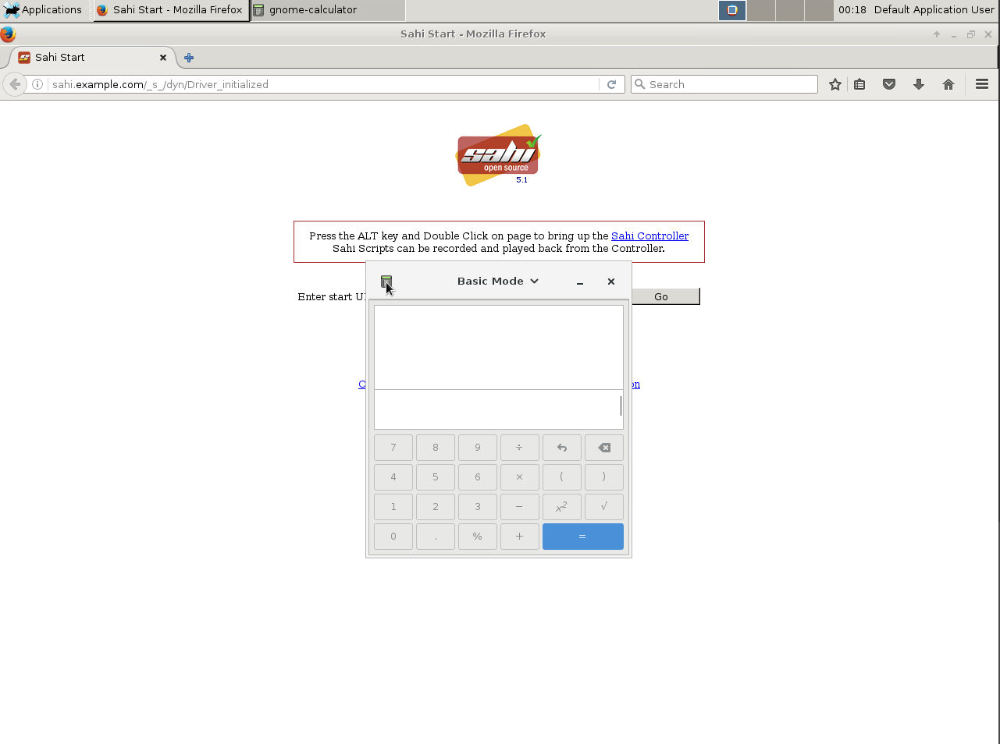
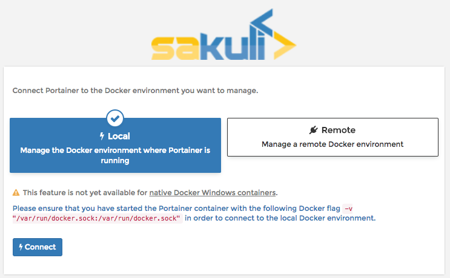
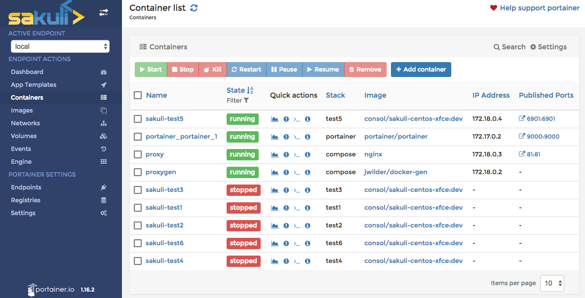

# sakuli-compose
Easy scheduling of [Sakuli](www.sakuli.org) E2E containers with docker-compose

## Description
`sakuli-compose` is a small framework to schedule the start of [Sakuli](www.sakuli.org) E2E test containers in one or more "chains" on a Docker host. No need to define a `docker-compose` file for each test.

A *chain* defines which Sakuli tests should be executed one by another. Executing "n" chains ensures both that there will be never more than "n" Sakuli container running at the same time and that the host never idles merely to leave enough headroom time for each check.

To get access to the [VNC console](https://github.com/ConSol/sakuli/blob/master/docs/manual/execution/containerized/docker-images.adoc) of running Sakuli containers, the project also provides a combination of [nginx](https://nginx.org/en/) (reverse proxy) and and [docker-gen](https://github.com/jwilder/docker-gen) to generate the nginx configuration on the fly.  

## Prerequisites

To let `sakuli-compose` start Sakuli containers, you need a Linux host with

* Docker
* `docker-compose`
* git (to clone the project)

## Setup

```
git clone https://github.com/simonmeggle/sakuli-compose.git
cd sakuli
```

## Sakuli tests

### sakuli-compose.sh: Start a single Sakuli test



The following command starts the suite `./testsuites.example/test1`:
```
./sakuli_compose.sh -s test1
```

If there is a rc file in `./rc.d/test1`, it is sourced before to add/change specific parameters.

### sakuli-compose-chain.sh: Start a chain of Sakuli tests



The following command starts a chain defined in `./rc.d/sakuli_compose_chain1.rc` (`-l`: loop):

```
./sakuli_compose_chain.sh -c rc.d/sakuli_compose_chain1.rc -l
```

To start a second chain, add `-p 1` to increment the VNC port (based on 6901) by one:

```
./sakuli_compose_chain.sh -c rc.d/sakuli_compose_chain2.rc -l -p 1 2>&1 >/dev/null &
```

## noVNC connection with reverse proxy

To ease the access to the VNC console of a specific Sakuli test, you can start the compose file for the reverse proxy ([nginx](https://nginx.org/en/)), which gets configured automatically by [docker-gen](https://github.com/jwilder/docker-gen).

Each time a container starts and dies, `docker-gen` automatically creates a nginx configuration based on a Golang template file:

```
cp ./sakuli-compose/conf/nginx/proxy.tmpl /var/lib/docker/data/proxygen/proxy.tmpl
```

Start the nginx and docker-gen containers (use `-d` to daemonize):
```
docker-compose  -f compose/docker-compose-revproxy.yml up
Starting proxygen ...
Starting proxygen ... done
Attaching to proxy, proxygen
proxygen    | 2018/02/17 23:34:12 Contents of /conf/proxy.conf did not change. Skipping notification ''
proxygen    | 2018/02/17 23:34:12 Watching docker events
proxygen    | 2018/02/17 23:34:13 Contents of /conf/proxy.conf did not change. Skipping notification ''
```

When you start a Sakuli suite (see above),  `docker-gen` will get notified...

```
proxygen    | 2018/02/17 23:34:38 Received event start for container 8bc5f8a1ccd6
proxygen    | 2018/02/17 23:34:38 Error inspecting container: ceebd624957253b4b51364e1e25b0fff0959dc162178b32e169898e93aeaf9fe: No such container: ceebd624957253b4b51364e1e25b0fff0959dc162178b32e169898e93aeaf9fe
proxygen    | 2018/02/17 23:34:38 Generated '/conf/proxy.conf' from 3 containers
proxygen    | 2018/02/17 23:34:38 Sending container 'proxy' signal '1'
```

and generate the nginx config file:

```
watch -n 1 cat /var/lib/docker/data/nginx/etc/nginx/conf.d/proxy.conf

error_log /dev/stdout debug;
server {
   listen 81;
   location /sakuli-test1 {
        proxy_pass http://172.18.0.4:6901;
        proxy_set_header X-Real-IP $remote_addr;
        proxy_set_header Host $host;
        proxy_set_header X-Forwarded-For $proxy_add_x_forwarded_for;
        # WebSocket support (nginx 1.4)
        proxy_http_version 1.1;
        proxy_set_header Upgrade $http_upgrade;
        proxy_set_header Connection "upgrade";
        # Path rewriting
        rewrite /sakuli-test1/(.*) /$1 break;
        proxy_redirect off;
    }
}
```

Open your browser and Open
* [http://[DOCKERHOST]]:81/sakuli-test1/vnc_auto.html?path=sakuli-test1]()
* [http://[DOCKERHOST]]:81/sakuli-test3/vnc_auto.html?path=sakuli-test3]()
* [http://[DOCKERHOST]]:81/sakuli-test5/vnc_auto.html?path=sakuli-test5]()


Add `&password=sakuli&view_only=true` to auto-login and to enable view-only mode.




## Portainer dashboard

Start the [Portainer](https://portainer.io/) dashboard with:

```
docker-compose -f compose/docker-compose-portainer.yml -p portainer up -d
```

Open in your browser  http://[DOCKERHOST]]:9000/ and click on "Local" connection:



After clicking "Connect", you are presented a nice dashbord with a overview of all running Sakuli containers (and others as well):




# References
This project was inspired by:

* https://techblog.sitegeist.de/docker-compose-setup-mit-nginx-reverse-proxy/
* https://xsteadfastx.org/2016/03/01/nginx-im-container-und-docker-gen/
* http://jasonwilder.com/blog/2014/03/25/automated-nginx-reverse-proxy-for-docker/
* https://blog.confirm.ch/docker-reverse-proxy/


# Todo / Issues

# TODO:
* Makefile for /var/lib/docker/data/proxygen/proxy.tmpl
* VNC native connection
* monitoring integration
